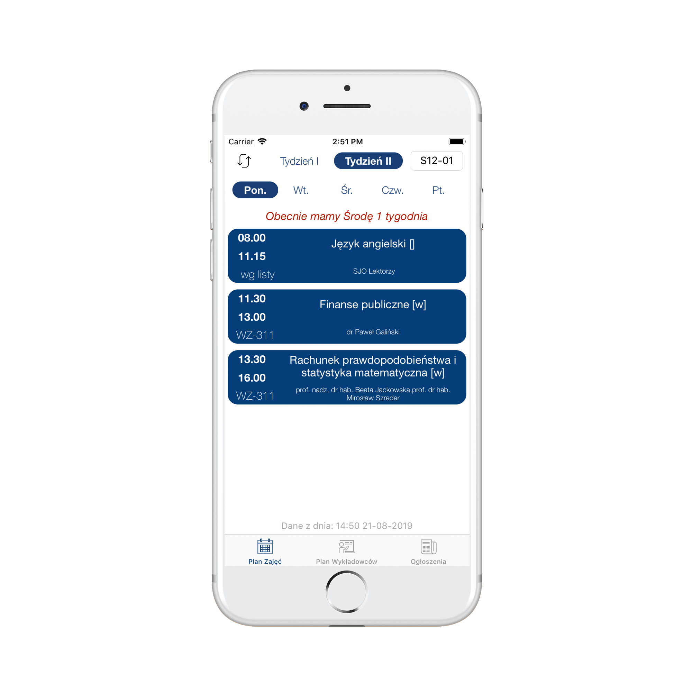

# Aplikacja-Mobilna-WZR

### IOS App for students and lecturers from Faculty of Management of the University of Gdańsk.

##### Author: Mateusz Łukasiński

## Features:
* Browse timetables, that are downloaded and stored locally on the device,
* Saving user choices (group that user choose will be his default)
* Browse lecturer's timetables, tutorship hours and emails that are stored locally 
* Instant access to lecturer's site on wzr.ug.edu.pl for more info (internet connection required)
* check last news from website that also are stored later on the device 
* all features are avaliable for both full time and part time students 

## Used Technologies:
* Swift 5
* Apple Storyboards (for App Views)
* Realm Swift (for Database)
* SwiftSoup (for scrapping data from websites)
* CSV.swift (for parsing CSV data) 
* Lottie (for animations)
* BetterSegmentedControl (for smoother segment control)
* SwipeableTabBarController (for tab bar controller animations) 

## Screenshots:

Pick between full time and part time:

Timetable view:

Lecturers timetable view:

Lecturer details view:

Web lecturers view:

News view:

## Gifs:

 
 
 
 
 
